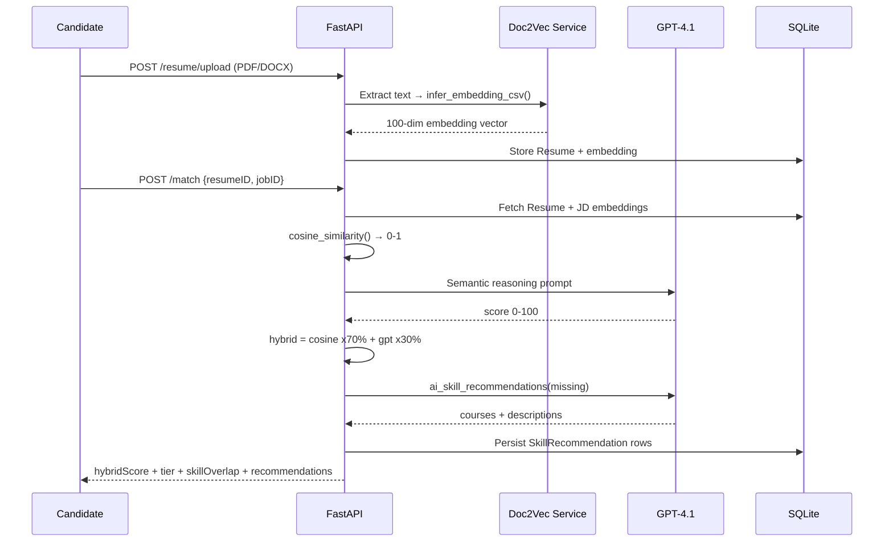
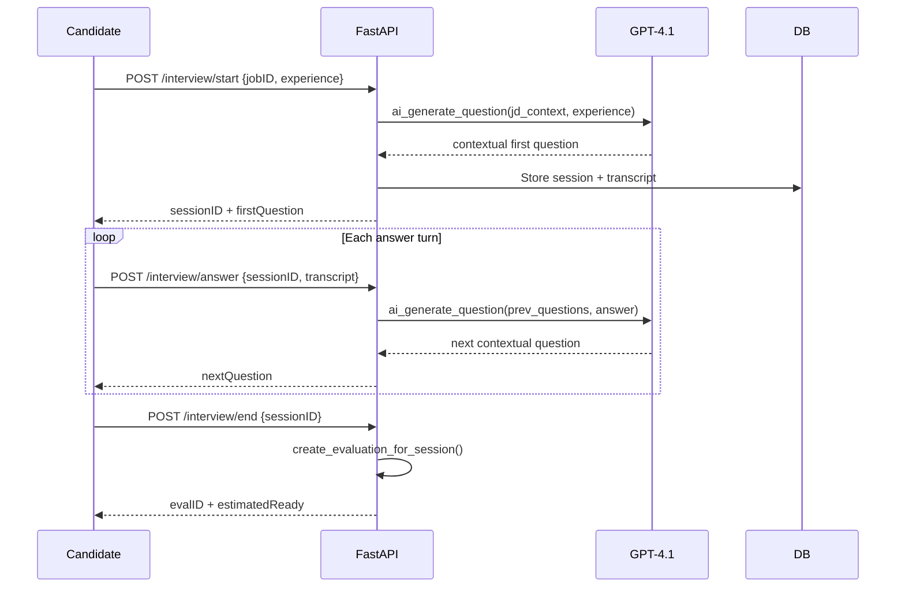

<div align="center">

# 🚀 Career Connect AI

### AI-Powered Recruitment Automation Platform

**Semantic Resume Screening · Skill Gap Analysis · AI Interviews · Multimodal Evaluation**

[](https://fastapi.tiangolo.com/)
[](https://react.dev/)
[](https://python.org/)
[](https://github.com/marketplace/models)
[](LICENSE)

</div>

---

## 📌 Overview

**Career Connect AI** is a full-stack recruitment automation platform that replaces manual resume screening with an AI-driven pipeline. It uses **Doc2Vec embeddings**, **GPT-4.1 semantic reasoning**, and upcoming **multimodal analysis** (emotion, speech, identity) to give HR teams objective, data-backed hiring decisions — and gives candidates a personalised roadmap to close their skill gaps.

---

## ✨ Features

### ✅ Implemented (Phase 1 & 2)

| Module | Feature |
|---|---|
| 🔐 **Auth** | JWT-based register/login, role-based access (Candidate / HR / Admin) |
| 📄 **Resume Upload** | PDF & DOCX parsing, Doc2Vec embedding on upload |
| 💼 **Job Descriptions** | HR creates JDs with title, description & required skills; auto-embedded |
| 🧠 **Semantic Matching** | Doc2Vec cosine similarity + GPT-4.1 hybrid score (FR-4.1, 4.4) |
| 🎨 **Match Score UI** | Circular progress rings, colour-coded tier (Green / Amber / Red) (FR-4.2) |
| 🔍 **Skill Overlap** | Matched, missing, and extra skills (FR-4.3) |
| 📊 **Recruiter View** | Sortable & filterable ranked candidate table (FR-4.5) |
| 🗺️ **Skill Gap Analysis** | AI-detected missing skills with impact ranking (FR-5.1, 5.3) |
| 📚 **Learning Recommendations** | GPT-4.1 course names, topic descriptions, estimated time (FR-5.2) |
| 📖 **Smart Article Redirect** | "Start Learning →" opens best GPT-chosen tutorial in new tab |
| ✅ **Progress Tracking** | Mark skills In Progress / Completed; full event history (FR-5.4) |
| 🤖 **AI Interview** | Dynamic JD-contextualised question generation via GPT-4.1 RAG |

### 🔜 Roadmap (Phase 3+)

| Module | Status |
|---|---|
| 😐 **Emotion Analysis** | DeepFace integration during interview — planned |
| 🔊 **Speech Analysis** | Librosa + RAVDESS tone/sentiment — planned |
| 🛡️ **Anti-Cheat Engine** | YOLOv8 multi-person detection + tab-switch guards — planned |
| 🪪 **Identity Verification** | Face-match against uploaded ID — planned |
| 📄 **PDF Reports** | ReportLab evaluation reports — planned |
| 📨 **Event-Driven Pipeline** | RabbitMQ / Kafka for async processing — planned |
| 🐳 **Containerisation** | Docker + Kubernetes deployment — planned |

---

## 🏗️ Architecture

```mermaid
graph TB
    subgraph Frontend["🖥️ Frontend (React + Vite + Tailwind)"]
        UI_Auth[Auth Pages]
        UI_Dashboard[Dashboard]
        UI_Match[Resume & Job Match]
        UI_Interview[AI Interview]
        UI_Reports[Reports]
    end

    subgraph Backend["⚙️ Backend (FastAPI)"]
        direction TB
        API[REST API :8000]

        subgraph Routers["Routers"]
            R_Auth[/auth]
            R_Resume[/resume]
            R_JD[/jd]
            R_Match[/match]
            R_Interview[/interview]
            R_Eval[/evaluation]
            R_Rec[/recommendations]
            R_Report[/report]
            R_HR[/hr]
        end

        subgraph Services["AI Services"]
            SVC_AI["ai_service.py — GPT-4.1 via GitHub AI"]
            SVC_D2V["doc2vec_service.py — Doc2Vec Embeddings"]
            SVC_GEM["gemini_service.py — Compatibility Shim"]
        end

        subgraph Core["Core"]
            SEC["security.py — JWT + Passlib"]
            CFG["config.py — Pydantic Settings"]
            DB_MOD["models.py — SQLAlchemy ORM"]
        end
    end

    subgraph Storage["💾 Storage"]
        DB[(SQLite / PostgreSQL)]
        FS[File System — Doc2Vec Artifacts]
    end

    subgraph ExternalAI["🤖 External AI"]
        GITHUB_AI["GitHub AI Inference — openai/gpt-4.1"]
    end

    Frontend -->|HTTP + JWT| API
    API --> Routers
    Routers --> Services
    Routers --> Core
    Services --> ExternalAI
    Services --> SVC_D2V
    Core --> DB_MOD
    DB_MOD --> DB
    SVC_D2V --> FS
```

---

## 🔄 Resume Matching Pipeline



---

## 🤖 AI Interview Flow



---

## 🗂️ Project Structure

```
Career-Connect-AI/
│
├── src/                            # React + Vite frontend
│   ├── pages/
│   │   ├── ResumeMatch.tsx         ✅ Full matching & skill gap UI
│   │   ├── InterviewSelection.tsx
│   │   ├── Dashboard.tsx
│   │   ├── Reports.tsx
│   │   └── Profile.tsx
│   ├── context/AuthContext.tsx     # JWT auth state
│   ├── lib/api.ts                  # apiFetch utility
│   └── index.css                   # Tailwind + global styles
│
└── backend/
    ├── app/
    │   ├── main.py                 # FastAPI app + CORS + router wiring
    │   ├── models.py               # SQLAlchemy ORM models
    │   ├── schemas.py              # Pydantic request/response schemas
    │   ├── db.py                   # DB engine + session factory
    │   ├── deps.py                 # JWT auth middleware
    │   ├── security.py             # Password hashing + JWT creation
    │   ├── ai_service.py           🤖 GPT-4.1 unified service layer
    │   ├── doc2vec_service.py      # Doc2Vec embed / train / infer
    │   ├── gemini_service.py       # Shim → ai_service
    │   ├── utils.py                # TF-IDF, token extraction, hashing
    │   ├── core/config.py          # Pydantic settings (.env loader)
    │   ├── artifacts/              # Pretrained doc2vec.model
    │   └── routers/
    │       ├── auth.py
    │       ├── resume.py
    │       ├── jd.py
    │       ├── match.py            # Hybrid scoring engine
    │       ├── interview.py        # GPT-4.1 RAG interview
    │       ├── evaluation.py
    │       ├── recommendations.py  # + /resource-url endpoint
    │       ├── report.py
    │       ├── dashboard.py
    │       ├── history.py
    │       └── profile.py
    ├── requirements.txt
    └── .env                        # Secrets (not committed)
```

---

## 🛠️ Tech Stack

| Layer | Technology |
|---|---|
| **Frontend** | React 18, Vite, TypeScript, Tailwind CSS, Lucide Icons |
| **Backend** | FastAPI, Uvicorn, Python 3.11+ |
| **Database** | SQLite (dev) / PostgreSQL (prod) via SQLAlchemy |
| **AI — Primary** | GPT-4.1 via [GitHub AI Inference](https://github.com/marketplace/models) (OpenAI SDK) |
| **AI — Embeddings** | Doc2Vec (Gensim) |
| **AI — Fallback** | TF-IDF cosine similarity (always offline-safe) |
| **Auth** | JWT (python-jose) + bcrypt (passlib) |
| **File Parsing** | PyPDF2, python-docx |

---

## ⚡ Quick Start

### Prerequisites
- Python 3.11+, Node.js 18+
- A [GitHub PAT](https://github.com/settings/tokens) with model access

### 1. Clone
```bash
git clone https://github.com/Shreyyy07/Career-Connect-AI---Major-Project1.git
cd Career-Connect-AI---Major-Project1
```

### 2. Backend
```bash
cd backend
python -m venv venv
venv\Scripts\activate          # Windows
# source venv/bin/activate     # Mac/Linux
pip install -r requirements.txt
```

Create `backend/.env`:
```env
DATABASE_URL=sqlite+pysqlite:///./career_connect_ai.db
JWT_SECRET=your-secret-key-here
CORS_ORIGINS=http://localhost:5173
GITHUB_TOKEN=github_pat_xxxxxxxxxxxx
GITHUB_AI_ENDPOINT=https://models.github.ai/inference
GITHUB_AI_MODEL=openai/gpt-4.1
```

```bash
python -m uvicorn app.main:app --reload
# → http://localhost:8000
# → Swagger: http://localhost:8000/docs
```

### 3. Frontend
```bash
cd ..
npm install
npm run dev
# → http://localhost:5173
```

---

## 📡 Key API Endpoints

| Method | Endpoint | Description |
|---|---|---|
| `POST` | `/api/v1/auth/register` | Register user |
| `POST` | `/api/v1/auth/login` | Login → JWT |
| `POST` | `/api/v1/resume/upload` | Upload PDF/DOCX |
| `POST` | `/api/v1/jd/upload` | Create JD (HR only) |
| `POST` | `/api/v1/match` | Run hybrid AI match |
| `GET` | `/api/v1/hr/matches` | Recruiter ranked view |
| `GET` | `/api/v1/recommendations/{id}/resource-url` | GPT article URL |
| `POST` | `/api/v1/recommendations/{id}/status` | Update learning status |
| `POST` | `/api/v1/interview/start` | Start AI interview |
| `POST` | `/api/v1/interview/answer` | Submit answer → next Q |
| `POST` | `/api/v1/interview/end` | End → trigger evaluation |
| `GET` | `/api/v1/health` | Health check |

---

## 🧠 AI Service Functions

All in `backend/app/ai_service.py` with graceful offline fallbacks:

| Function | Purpose | Fallback |
|---|---|---|
| `ai_semantic_score()` | Resume–JD match (0–100) | TF-IDF cosine |
| `ai_generate_question()` | Dynamic interview question | Static question bank |
| `ai_evaluate_answer()` | Score answer quality | 50.0 |
| `ai_skill_recommendations()` | Courses + descriptions + time | Empty list |
| `ai_find_resource_url()` | Best tutorial URL for a skill | Google search URL |

---

## 🗃️ Database Schema

```
User ──────────┬───── Resume (embedding_csv)
               ├───── JobDescription (embedding_csv, skills_csv)
               ├───── InterviewSession ── Evaluation
               ├───── Assessment
               └───── SkillRecommendation ── SkillRecommendationEvent
```

---

## 🔒 Security

- Bearer JWT required on all endpoints except `/auth/*`
- Passwords hashed with bcrypt
- Role-based access: `candidate` | `hr` | `admin`
- CORS restricted to configured origins

---

## 📄 License

MIT — see [LICENSE](LICENSE) for details.

---

<div align="center">

Built with ❤️ by **Shreyash** · Powered by **GPT-4.1**, **Doc2Vec** & **FastAPI**

⭐ Star this repo if you find it useful!

</div>
