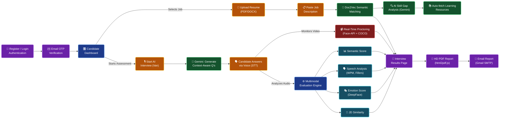
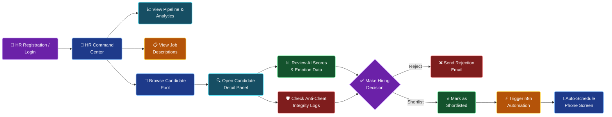
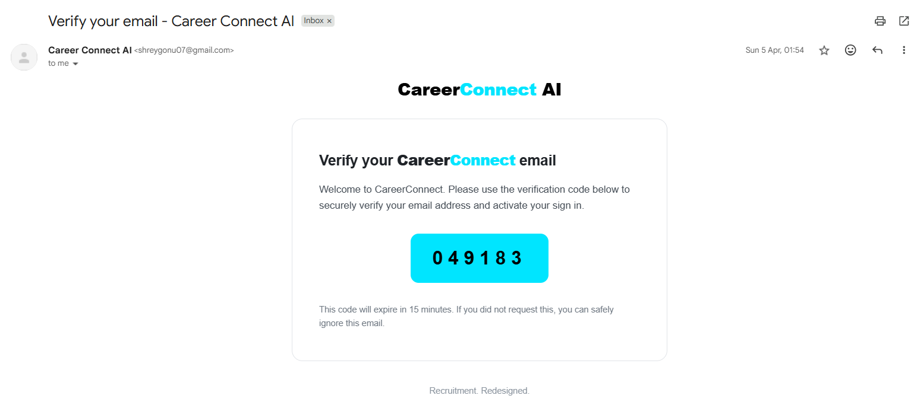
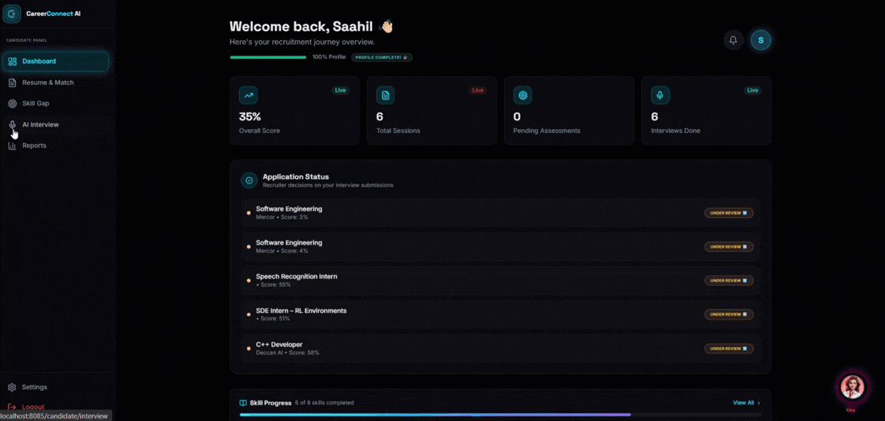
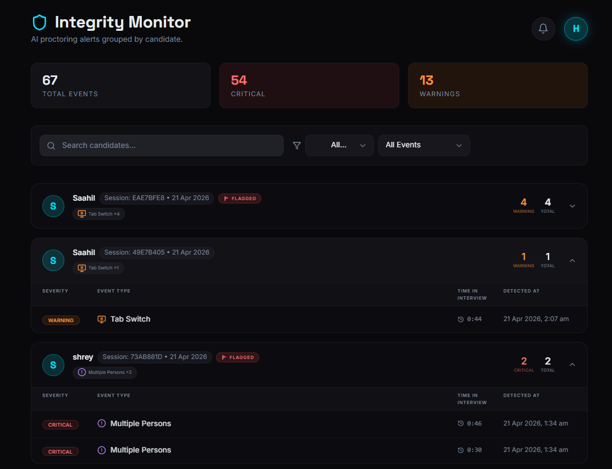
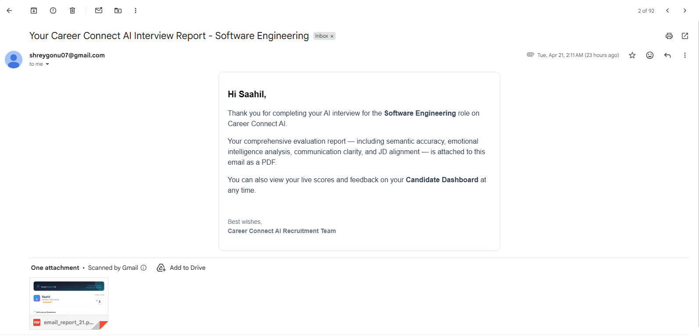
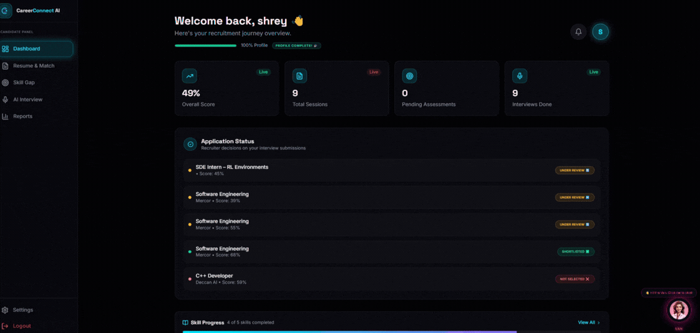
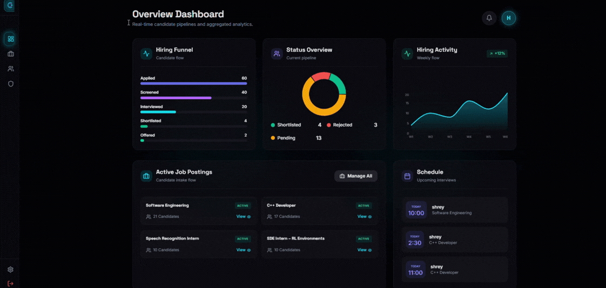
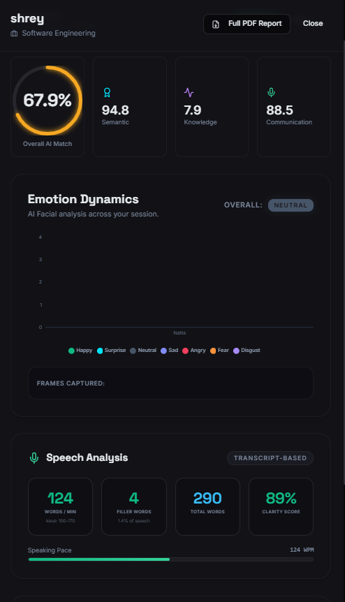

<div align="center">

# 🚀 Career Connect AI

### An Enterprise-Grade AI Recruitment Automation Platform

**Semantic Resume Screening • Adaptive AI Interviews • Multimodal Behavioral Analysis • Real-Time Proctoring • n8n Call Automation**

[](https://fastapi.tiangolo.com/)
[](https://react.dev/)
[](https://python.org/)
[](https://ai.google.dev/)
[](https://www.typescriptlang.org/)
[](https://www.postgresql.org/)
[](LICENSE)

</div>

---

## 📖 Overview

**Career Connect AI** is a production-ready, full-stack AI recruitment platform that replaces manual screening pipelines with a fully automated, intelligent hiring engine. It features two dedicated portals — a **Candidate Dashboard** for interviews and skill growth, and an **HR Command Center** for pipeline management and integrity monitoring.


---

## 🗺️ System Flows

### 🎓 Candidate Journey



### 🏢 HR / Recruiter Journey



---

## ✨ Features

### 🔐 Authentication & Onboarding
- Separate registration and login flows for Candidates and HR Recruiters
- **6-digit OTP email verification** before account activation
- JWT-based protected routes with secure token handling
- Full OTP-based **Forgot Password** reset flow



---

### 📄 Semantic Resume Matching
- Upload PDF or DOCX — parsed instantly via `pdfplumber` / `python-docx`
- **Doc2Vec embeddings** + **cosine similarity** for meaning-based matching (not keywords)
- Produces a precise **Match Score (%)** measuring conceptual alignment with the JD
- Google Gemini identifies **Matched Skills** and **Missing Skills** with priority ranking
- **SerpAPI** auto-discovers the best free learning resource for every skill gap


---

### 🤖 AI Virtual Interview (Van)
- **Van** — a voice AI persona powered by browser-native Web Speech API (TTS + STT)
- **Google Gemini 1.5 Pro** generates 5 role-specific, resume-aware questions per session
- Candidates answer naturally by speaking; Van listens and moves to the next question
- Voice commands supported: *"Van, show my score"*, *"Van, download my report"*
- Full Q&A transcript stored in structured `Q: / A:` format for downstream analysis

---

### 📊 Multimodal Evaluation Engine
- **Semantic Score** — candidate answers embedded and compared against JD vectors
- **Speech Analysis** — real WPM, filler word count (um, uh, like…), clarity score
- **Emotion Score** — per-frame DeepFace classification aggregated across the session
- **JD Similarity Score** — overall answer-to-JD text alignment
- **Incompleteness Penalty** — strict score reduction if questions are skipped or session ended early



---

### 🛡️ Real-Time Anti-Cheat Proctoring
- **Multiple persons / no face** — detected via `face-api.js`, triggers `CRITICAL` log
- **Mobile phone in frame** — detected via `COCO-SSD` TensorFlow.js, instant 3.5s visual warning
- **Tab switch / focus loss** — captured via `visibilitychange` + `blur` events, logs `WARNING`
- All events are POST'd to the backend with timestamp and severity, stored per session
- Debounced per detection type (15s cooldown) to prevent event spam



---

### 📑 Reports & Email Delivery
- Full **Interview Results page** with animated score gauges, per-answer AI feedback, and emotion timeline
- **HD PDF Report** — React component rendered off-screen at 794px (A4), captured at 2x retina scale via `html2pdf.js`
- **"Email My Report"** — PDF encoded as Base64 on the frontend, sent to backend, attached and delivered via **Gmail SMTP/TLS**



---

### 🧑‍💻 Candidate Dashboard
- Live stats: Average Score, Total Sessions, Interviews Done, Pending Assessments
- **Application Status Tracker** — shows HR decision (Shortlisted ✅ / Under Review 🔄 / Not Selected ❌) per submission
- **Skill Progress Panel** — live sync of recommendation statuses (Not Started / In Progress / Completed)
- Performance trend charts powered by Recharts
- Profile completion tracker with actionable upgrade prompts



---

### 🏢 HR Command Center

#### Dashboard
- Hiring funnel visualization, score distribution histogram, top-performer feed
- Week-on-week session and application trend charts



#### Candidate Management
- Search and filter candidates by name, job, or score
- Full detail panel per candidate: sub-scores, transcript, emotion timeline, anti-cheat summary
- One-click **Shortlist / Reject** with candidate notification



#### Job Description Management
- Create, edit, and archive JDs used to auto-generate interview questions
- View the full candidate pool per JD

#### Integrity Monitor
- Anti-cheat events grouped per **interview session** (not just candidate) — so you can isolate violations per date
- 🚩 **FLAGGED** badge auto-applied for sessions with 2+ CRITICAL events
- Filter by severity: `CRITICAL` / `WARNING` / event type

---

### 📞 n8n Call Automation
- Webhook-compatible HR endpoints ready for **n8n.io** workflow integration
- Shortlisted candidates can be auto-queued for phone-screening calls or SMS follow-ups
- Fully removes manual recruiter outreach from early-stage pipeline

---

## 🏗️ Tech Stack

| Layer | Technology |
|-------|-----------|
| Frontend | React 18, TypeScript, Vite, Framer Motion, Recharts |
| Styling | Tailwind CSS (Glassmorphism design system) |
| Backend | FastAPI, SQLAlchemy, Pydantic, Python 3.11 |
| LLM | Google Gemini 1.5 Pro |
| Semantic NLP | Doc2Vec (gensim), Cosine Similarity |
| Computer Vision | YOLOv8 (Ultralytics), DeepFace, face-api.js, COCO-SSD |
| Speech | Web Speech API (STT + TTS) |
| PDF Generation | html2pdf.js + html2canvas |
| Email | Gmail SMTP/TLS |
| Database | PostgreSQL |
| Automation | n8n Workflows |

---

## 🚀 Getting Started

### Prerequisites
- Node.js 18+, Python 3.11+, PostgreSQL instance
- API Keys: `GEMINI_API_KEY`, `SERPAPI_KEY`, Gmail App Password

### Backend
```bash
cd backend
python -m venv venv && venv\Scripts\activate
pip install -r requirements.txt
# Configure .env (see .env.example)
uvicorn app.main:app --reload
```

### Frontend
```bash
npm install
npm run dev
# Runs at http://localhost:8085
```

---

## 🔌 Key API Endpoints

| Method | Route | Description |
|--------|-------|-------------|
| `POST` | `/api/v1/auth/register` | Candidate / HR registration |
| `POST` | `/api/v1/auth/login` | Login & JWT token issue |
| `POST` | `/api/v1/resume/upload` | Upload & parse resume |
| `POST` | `/api/v1/match/` | Semantic resume-JD matching |
| `POST` | `/api/v1/interview/start` | Begin AI interview session |
| `POST` | `/api/v1/interview/end` | End session & trigger evaluation |
| `GET`  | `/api/v1/evaluation/{id}` | Fetch full evaluation results |
| `POST` | `/api/v1/evaluation/{id}/send-email` | Email HD PDF report |
| `POST` | `/api/v1/analysis/anticheat-event` | Log proctoring violation |
| `GET`  | `/api/v1/hr/candidates` | HR: List all candidates |
| `POST` | `/api/v1/hr/decision/{id}` | HR: Shortlist or reject |
| `GET`  | `/api/v1/hr/anticheat` | HR: Integrity monitor events |

---

## 🗺️ Roadmap

- [ ] Mobile responsive layout for Candidate portal
- [ ] Recruiter bulk-action on candidates (multi-select shortlist)
- [ ] Custom scoring weight configuration per JD
- [ ] Webhook-based real-time notification delivery
- [ ] n8n full integration testing and deployment guide
- [ ] Multilingual interview support

---

## 👨‍💻 Author

Built with ❤️ by **Shrey**, demonstrating a complete applied-AI engineering stack from NLP and computer vision to full-stack web development.

---

<div align="center">
  <i>Redefining how talent meets opportunity — one AI conversation at a time.</i>
</div>
