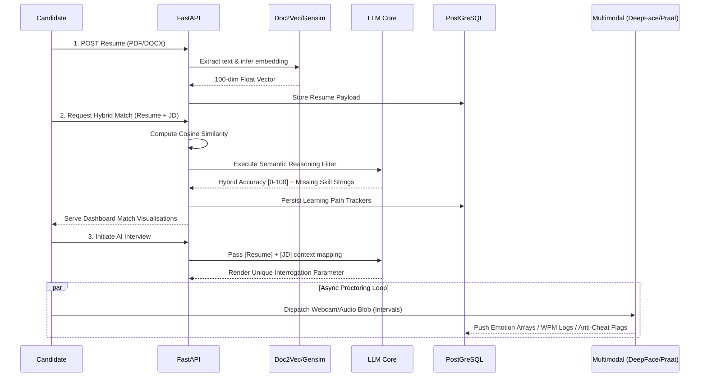
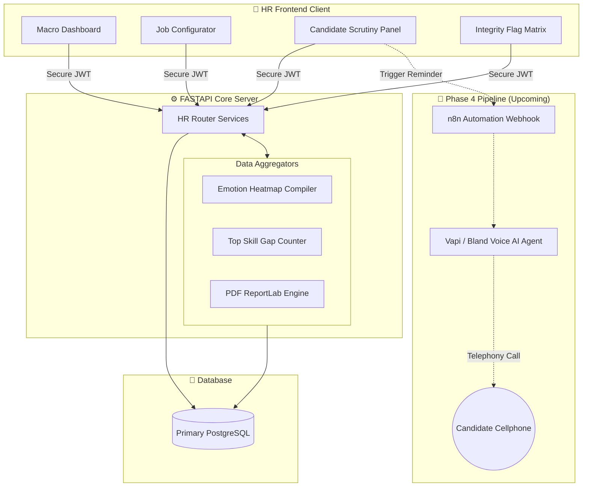

<div align="center">

# 🚀 Career Connect AI

### An Enterprise-Grade AI Recruitment Automation Platform

**Semantic Resume Screening · Skill Gap Analysis · AI Interviews · Multimodal Evaluation**

[](https://fastapi.tiangolo.com/)
[](https://react.dev/)
[](https://python.org/)
[](https://github.com/marketplace/models)
[](LICENSE)

</div>

---

## 📌 Overview

**Career Connect AI** is a full-stack recruitment automation platform that completely digitises the hiring bottleneck. It replaces manual screening with an AI-driven pipeline using **Doc2Vec embeddings**, **Gemini/GPT LLM semantic reasoning**, and robust **multimodal analysis** (DeepFace Emotion, Praat Speech, YOLO Anti-Cheat) to give HR teams objective, data-backed hiring parameters — whilst supplying candidates with a bespoke roadmap to close their exact skill gaps.

---

## ✨ Features (Fully Implemented)

### 👨‍💼 Candidate Module
| Feature | Description |
|---|---|
| 🔐 **OTP Auth Flow** | High-security email token verifications & forgotten password reset. |
| 📄 **Resume Pipeline** | PDF/DOCX multi-modal uploads parsed natively and stored directly into Vector DBs. |
| 🧠 **Semantic Matching** | Doc2Vec cosine similarity + LLM semantic reasoning creating a 0-100 hybrid compatibility scale. |
| 🗺️ **Skill Gap Engine** | Identifies critical weaknesses, mapping them to a **Personalised Learning Path** (with "Mark as Done" UI trackers). |
| 🤖 **AI Interview Agent** | Dynamically crafts logic questions based specifically on the users Resume context + JD requirements. |
| 📊 **Candidate Reports** | Real-time AI evaluation, PDF ReportLab generation, and visual component breakdown (Semantic, Emotion, Speech). |

### 🏢 HR Recruiter Module
| Feature | Description |
|---|---|
| 💼 **JD Management** | HRs dynamically create Job Descriptions with Title, specific Requirements, and Auto-Embeddings. |
| 🕵️ **Shortlist Pipeline** | Granular visual table allowing recruiters to easily filter heavily ranked candidates. |
| 📉 **Analytics Dashboard** | Live overall funnel, **Top Skills Gap** visualisation bar charts, and a **Macro Emotion Spectrum** heat-map. |
| 🗣️ **Detailed Telemetry** | View candidate timeline showcasing stress-levels versus confidence, alongside WPM (Words Per Minute) calculations. |
| 🛡️ **Integrity Risk Monitor** | Anti-cheat log that forces AI-Proctor flagged candidates to the absolute top of the shortlist priority queue. |

---

## 🏗️ Technical Architectures

### 1️⃣ Candidate Pipeline (Assessment & Data)



### 2️⃣ HR Recruiter Flow & Dashboard Architecture



---

## 🚀 Future Roadmap: n8n Voice Agent Integration

Our immediate target for Phase 4 is to deploy **n8n Automation + Real-World Voice AI**.
- **The Concept:** When a candidate is shortlisted or scheduled via the HR Dashboard, the FastAPI backend will trigger an outgoing webhook to an `n8n` cloud workflow.
- **The Call:** `n8n` will connect to a Telephony/Voice AI endpoint (e.g., Bland AI, Vapi) to physically ring the candidate's personal cellphone grid. 
- **The Loop:** The system will hold a seamless LLM-voice conversation, actively remind the candidate of their impending Career Connect AI interview, and ping the result back to the HR dashboard dynamically in real-time.

---

## 🗂️ Project Structure

```text
Career-Connect-AI/
├── src/
│   ├── pages/
│   │   ├── CandidateDashboard.tsx  &  CandidateSkills.tsx
│   │   ├── AIInterview.tsx         &  EvaluationResult.tsx
│   │   ├── HRDashboard.tsx         &  HRJobsPage.tsx
│   │   ├── HRCandidatesPage.tsx    &  HRAntiCheatPage.tsx
│   ├── components/                 # Shared logic (EmotionTimeline, etc.)
│   ├── lib/api.ts                  # Axios/Fetch interceptors
│   └── index.css
│
└── backend/
    ├── app/
    │   ├── main.py                 # FastAPI Gateway
    │   ├── models.py               # SQLAlchemy ORM
    │   ├── schemas.py              # Pydantic Typing
    │   ├── ai_service.py           # Unified LLM Service
    │   ├── doc2vec_service.py      # Resuming Parsing Logic
    │   ├── routers/
    │   │   ├── match.py            # Cosine + LLM routes
    │   │   ├── interview.py        # Interview state engines
    │   │   ├── evaluation.py       # Math composite compilers
    │   │   ├── report.py           # PDF generation routes
    │   │   └── hr.py               # Aggregations & Anti-cheat
    ├── requirements.txt
    └── .env
```

---

## 🛠️ Tech Stack

| Layer | Technology |
|---|---|
| **Frontend UI** | React 18, Vite, TypeScript, Tailwind CSS, Recharts |
| **Backend Core** | FastAPI, Uvicorn, Python 3.11+ |
| **Database** | SQLite (Dev) / PostgreSQL (Prod) via SQLAlchemy |
| **LLM Core** | GPT-4.1 / Gemini (Semantic matching + Interview scripting) |
| **Embeddings** | Doc2Vec (Gensim) |
| **Face & Speech AI**| DeepFace (Emotion), OpenCV/YOLO (YOLOv8 Object Detect) |
| **Authentication**| JWT (python-jose) + bcrypt (passlib) |
| **Report Engine** | PyPDF2, python-docx, ReportLab (PDF Synthesis) |

---

## ⚡ Quick Start & Deployment

### Prerequisites
- Python 3.11+, Node.js 18+
- Active API Key via GitHub Models or Google Gemini LLM.

### 1. Repository
```bash
git clone https://github.com/Shreyyy07/Career-Connect-AI---Major-Project1.git
cd Career-Connect-AI---Major-Project1
```

### 2. Backend
```bash
cd backend
python -m venv venv
venv\Scripts\activate          # Windows
pip install -r requirements.txt
```

Create `backend/.env`:
```env
DATABASE_URL=sqlite+pysqlite:///./career_connect_ai.db
JWT_SECRET=your-secret-key-here
CORS_ORIGINS=http://localhost:5173
```

Run the Server:
```bash
python -m uvicorn app.main:app --reload
# Rest API: http://localhost:8000
# Swagger : http://localhost:8000/docs
```

### 3. Frontend
```bash
cd ..
npm install
npm run dev
# App Interface: http://localhost:5173
```

---

## 📡 Key API Endpoints

| Method | Endpoint | Internal Description |
|---|---|---|
| `POST` | `/api/v1/auth/register` | Initial candidate / hr creation & logic map |
| `POST` | `/api/v1/resume/upload` | Extracts text and forces 100-dim Vector injection |
| `POST` | `/api/v1/jd/upload` | Core JD insertion logic |
| `POST` | `/api/v1/match` | Fires hybrid AI execution array |
| `GET`  | `/api/v1/hr/analytics` | Mass aggregates entire DB rows for Dashboard arrays |
| `POST` | `/api/v1/interview/start` | Establishes RAG context & pre-loads first target |
| `PATCH`| `/api/v1/recommendations/status`| Progress state manipulation |
| `GET`  | `/api/v1/report/download` | Initiates realtime PDF generation buffer |

---

<div align="center">

Built with ❤️ by **Shreyyy**

⭐ Star this repo if you find it useful!

</div>
